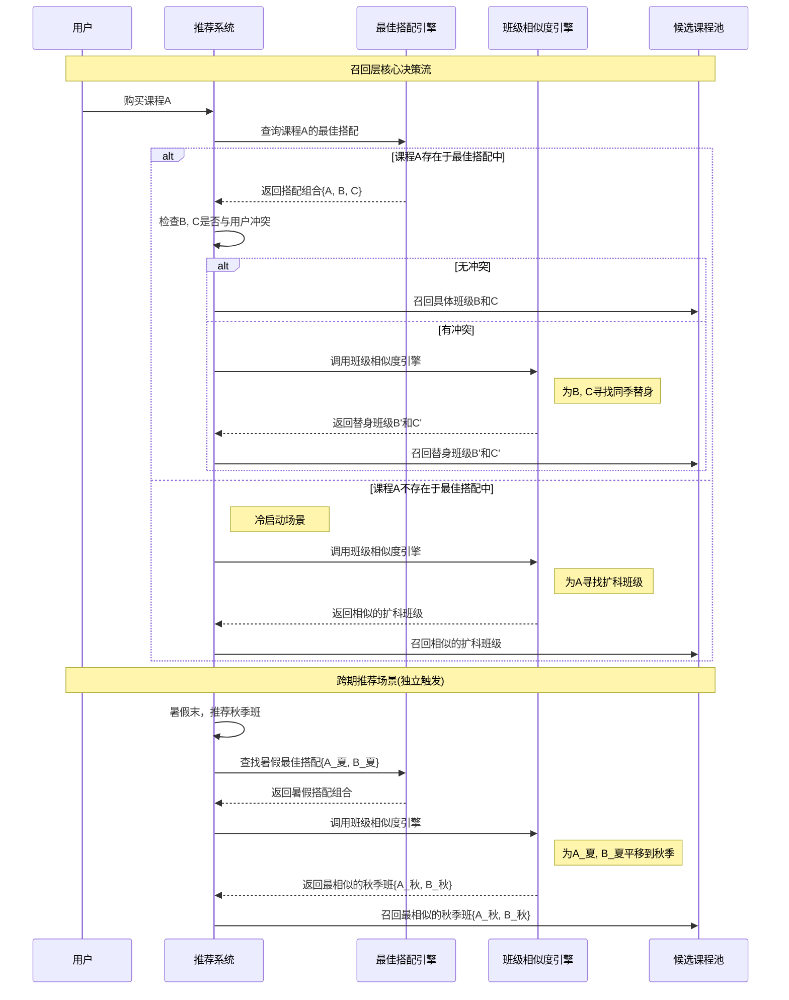

# 新东方课程推荐系统需求文档 (V1.0 整合版)

## 1. 概述与业务目标

### 1.1 项目目标

本推荐系统旨在提升用户的课程购买转化率和客单价，核心业务目标包括：

- **老生扩科**：为已报名的学员推荐其他科目的课程，提升交叉销售。
- **纯新生转化**：在新生首次购买时，通过"顺手搭"的形式推荐关联课程，完成初次转化和扩科 [cite: V0.5 老生扩科+纯新生转化.md]。

### 1.2 应用场景

初期核心应用场景为订单结算页的"顺手搭"推荐：根据用户当前即将购买的班级，推荐一个或多个可以联报的班级 [cite: XDF推荐系统建设思路.md]。

## 2. 系统整体架构

本推荐系统采用现代推荐标准的**"召回 → 排序 → 重排"**三层架构，以确保推荐的准确性、多样性和个性化。


## 3. 召回层 (Recall) 设计

召回层是推荐系统的"海选"阶段，其核心目标是**"宁可错杀，不可放过"**。它需要从数以万计的全量课程库中，快速、宽泛地筛选出一个包含几百个潜在相关课程的候选池，交给后续的排序层进行精选。本系统采用"数据驱动"与"规则驱动"并行的双策略召回模式，以实现召回的全面性、智能性和稳定性。

### 3.1 策略一："最佳搭配"召回 (数据驱动)

此策略是系统的**"智慧主力"**，旨在通过挖掘海量用户的真实购买行为，自动发现那些经过市场验证的"黄金课程组合"或"学习套餐"。

#### 实现流程详解：

1. **定义"事务" (Transaction)**：为精准捕捉用户的学习规划，一个"事务"被定义为一个学员在一个完整的培训周期（如2025年暑假）内所报名的所有班级 [cite: XDF推荐系统建设思路.md]。这比按单次订单分析更能反映真实的学科搭配关系。

   > **案例**：小明在2025年暑假先后购买了数学A班和英语C班，系统会为他构建一个事务：{数学A班, 英语C班}。

2. **定义"项" (Item)**：为克服具体班级ID带来的数据稀疏问题，一个"项"被抽象为班级的核心特征组合，如**{教师 + 科目}** [cite: XDF推荐系统建设思路.md]。

   > **案例**：[王老师-数学A班]和[王老师-数学B班]在挖掘时都被视为同一个项："王老师-数学"。此举将对具体班级的分析，提升为对核心教学资源的分析。

3. **频繁项集挖掘 (Mining)**：系统采用Apriori等算法，找出高支持度（组合的热门程度）和高置信度（组合内的推荐强度）的"项"组合，形成"最佳搭配"列表。

   > **案例**：算法发现{"王老师-数学", "李老师-英语"}是一个高频组合。当新用户购买了任何映射为"王老师-数学"的班级时，系统便会将所有映射为"李老师-英语"的在售班级召回。

### 3.2 策略二："班级相似度"召回 (规则驱动)

此策略是系统的**"全能工具箱"和"稳定压舱石"**。它是一个可复用的核心计算引擎，作为策略一的补充、替换和延伸，保证系统在任何复杂情况下都能给出合乎逻辑的推荐。

#### 核心原理：业务经验的规则化

此方法的核心是将资深教务和金牌销售的业务经验，翻译成机器可以理解和执行的、手工维护的"特征权重规则表" [cite: V0.5 老生扩科+纯新生转化.md]。系统通过逐项对比源班级和目标班级的14个维度属性，并根据此规则表进行计分，最终得出一个量化的相似度分数。

#### 计分流程详解

系统会为每个特征计算一个独立的分数，这些分数最终会代入一个总公式。

**基础分项 (加分项)**：这类特征主要通过加分来体现匹配度。

- **教师(F)**：相同+10，属性相似+5。体现了跟对老师是强续报意愿。
- **难度层级(K)**：相同+2，小于目标班+1。体现了保持或稍降难度的推荐原则。
- **源班编码(M)**：若目标班级是源班级官方指定的续报班，则+100。这是最高优先级的加分项。
- **管理项目(A)、产品体系(B)**：相同+1。作为基础匹配维度的加分。

**惩罚分项 (减分项)**：这类特征的差异会以扣分的形式影响总分。

- **开课日期(H)**：计算两个班级开课日期的天数差day(x1,x2)，差值越大，扣分越多。公式中体现为 - H*10/365，将天数差异归一化为一个影响因子。
- **上课时间段(J)**：计算两个班级上课时间的分钟差，差值越大，扣分越多。公式中体现为 - J*10/24。

**过滤/加权项 (乘法项)**：这类特征通常作为"硬性条件"，不满足则相似度为0，满足则不影响（乘以1）或有额外加权。

- **季度(C)、年级(D)、科目(E)**：这些特征的匹配逻辑非常复杂，且与场景（如同季扩科、跨季续报）强相关。它们通常作为过滤器使用，若不满足场景要求（如扩科时科目必须不同），则该项得分为0，导致最终总相似度为0。
- **剩余名额(L)**：等于0时取0，不等于0时取1。这是一个硬性过滤器，确保不推荐任何已满员的班级。

#### 最终相似度公式 (Likelihood)

所有单项特征分计算完毕后，将代入以下总公式，计算出最终的Likelihood分数。这个分数会传递给后续的排序层使用。

```
Likelihood = (M+K+I+F+A+B - H*10/365 - J*10/24) * C * D * E * L
```

[cite: V0.5 老生扩科+纯新生转化.md]

**公式解读**：

- 括号内的部分是**"基础分"**，由多个维度的加分项减去时间差异的惩罚项构成。
- 括号外的部分是**"过滤器"**，由多个硬性条件构成。只要其中任何一项不满足条件（得分为0），整个相似度就直接归零，该候选班级被淘汰。

#### 性能保障

为避免全局遍历带来的性能灾难，实际查询时会采用**"硬性筛选（索引）+ 软性计分（内存）"**的两阶段模式。先通过数据库或搜索引擎利用索引快速过滤出小范围候选集，再对这个小集合进行精细的相似度计分。

### 3.3 双策略协同与触发逻辑

系统并非随机选择策略，而是遵循一套清晰的指挥逻辑：优先调用策略一"最佳搭配"，仅在策略一无法满足任务时，才精准调用策略二"班级相似度"进行"战术支援"。



**"班级相似度"引擎被调用的核心场景**：

#### 场景1：冷启动/回退 (当"最佳搭配"无路可走时)

- **触发条件**：用户购买了一个全新的、不属于任何"最佳搭配"组合的课程（如：人工智能启蒙班）。策略一无法找到任何关联规则。
- **调用目标**：系统降级(Fallback)，调用策略二，寻找与人工智能启蒙班在基础属性（如年级、季度、校区）上相似的其他科目课程。
- **产出**：召回如[五年级 暑假 英语阅读班]等属性相似的课程。

#### 场景2：同季替换 (当"最佳搭配"中的选项需要"绕行"时)

- **触发条件**：策略一成功推荐了物理A班（周六上午），但系统检测到该班级与用户已有课程时间冲突。
- **调用目标**：系统调用策略二，为物理A班寻找一个"替身"。查找范围被严格限定在同季节、同科目、同年级且上课时间可用的班级内。
- **产出**：在限定范围内，找到与物理A班在教师、校区、难度等方面最相似的物理B班（周日下午）作为替换 [cite: XDF推荐系统建设思路.md, 6561752750037_.pic.jpg]。

#### 场景3：下季平移 (当需要为"最佳搭配"预测未来时)

- **触发条件**：当前是暑假末，需为用户推荐秋季班。策略一找到了暑假的黄金搭档{暑假数学, 暑假英语}。
- **调用目标**：系统调用策略二，将这个暑假的成功模式**"平移(Translate)"**到秋季。它会分别为"暑假数学"和"暑假英语"这两个概念，在秋季课程中寻找相似度最高的"继承者"。
- **产出**：找到并召回{六年级秋季数学, 六年级秋季英语}这个新的组合，完成跨期推荐 [cite: XDF推荐系统建设思路.md, 6561752750037_.pic.jpg]。

## 4. 排序层 (Rank & Re-rank) 设计

排序层负责对召回的候选课程池进行精细化打分排序。

### 4.1 精排 (Fine-Ranking)

此阶段使用一个固定的加权公式，计算每个课程的通用排序分。

**核心公式**：
```
final_score = (Likelihood*0.5 + subject*0.3 + ...)_*source
```
[cite: V0.5 老生扩科+纯新生转化.md]

**计分维度**：

- **Likelihood**：基础相似度分，继承自召回层 [cite: V0.5 老生扩科+纯新生转化.md]
- **subject**：固定的科目优先级（如：数学>英语>...）[cite: V0.5 老生扩科+纯新生转化.md]
- **level & stock**：难度匹配度和剩余名额 [cite: V0.5 老生扩科+纯新生转化.md]
- **teacher**：教师黑名单（有过退费记录-100分）[cite: V0.5 老生扩科+纯新生转化.md]
- **source**：来源加权（运营指定*10 > 算法推荐*5）[cite: V0.5 老生扩科+纯新生转化.md]

### 4.2 重排 (Re-ranking)

此阶段进行个性化微调，是提升用户体验的关键。

**核心驱动**：实时用户画像，特别是通过大模型（LLM）分析聊天记录得出的**"实时意图"** [cite: XDF推荐系统建设思路.md]。

**重排逻辑**：

- **意图加分**：精排结果1.英语, 2.数学。但若分析出用户聊天时刚表达了"想提高数学"的意图，则动态提升数学课的得分，使其排名上升 [cite: XDF推荐系统建设思路.md]
- **约束减分**：精排结果第一名是周六上午的课程。但重排时发现用户花名册中已有该时段的课程，则对此课程动态降权，避免推荐一个无法上的课 [cite: XDF推荐系统建设思路.md]

## 5. 运营后台管理

系统提供一个"推荐规则"后台，允许运营人员进行人工干预。

**功能**：运营可配置"当用户购买A，就从B池子里推荐"的业务规则 [cite: V0.5 老生扩科+纯新生转化.md]。

**专用算法**：当此类规则被触发时，系统会调用一套专用的、更宽松的"业务推荐召回"逻辑来从B池子中做筛选。此逻辑容错率更高（如：对信息缺失的字段不扣分），以保证运营配置的推荐能够大概率成功执行 [cite: V0.5 老生扩科+纯新生转化.md]。