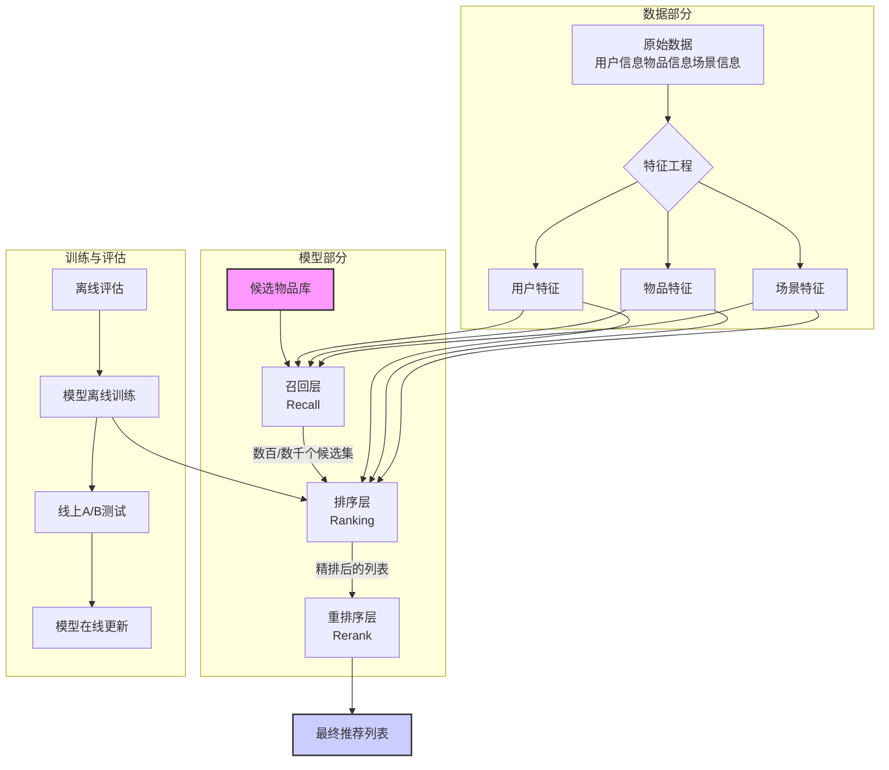

# 推荐系统核心思想与架构

本文档旨在阐明现代推荐系统的顶层设计思想与标准技术架构，为理解和构建推荐系统打下坚实的理论基础。

## 1. 推荐系统的"第一性原理"：f(U, I, C)

所有推荐系统，无论其内部多么复杂，其核心要解决的问题都可以被形式化地定义为一个函数：

```
Score = f(U, I, C)
```

这个公式是我们理解一切推荐问题的起点。

- **U (User)**: 代表用户信息。它回答了"你是谁？"以及"你喜欢什么？"的问题。这包括用户的静态画像（如年龄、年级、城市）和动态行为（如历史点击、购买记录、与客服的聊天记录）。

- **I (Item)**: 代表物品信息。它回答了"我是什么？"以及"我有什么特点？"的问题。在您的场景下，"物品"就是课程、老师、资料等。这包括物品的静态属性（如课程大纲、价格、科目）和动态统计（如近期报名人数、好评率）。

- **C (Context)**: 代表场景信息。它回答了"在什么时间、什么地点、什么情况下"进行推荐的问题。这包括推荐发生的时间、用户所在的页面（首页、结算页）、使用的设备等。

- **f(...)**: 代表预测函数，也就是我们构建的模型。它的工作是综合利用 U, I, C 三方面的信息，预测用户对物品的喜好程度。

- **Score**: 代表最终产出的分数。这个分数最常见的定义是预测点击率 (pCTR) 或 预测转化率 (pCVR)。系统根据这个分数对所有候选物品进行排序，生成最终的推荐列表。

## 2. 推荐系统的本质：预测而非匹配

传统观点认为推荐是"匹配"，即找到与用户兴趣"匹配"的物品。然而，现代推荐系统的本质更应该是**"预测"**。

- **匹配 (Matching)**: 基于已知的、显式的关系进行查找。例如，你喜欢A，就为你匹配与A相似的B。

- **预测 (Prediction)**: 基于复杂的模型，推断用户在未来可能产生的、甚至自己都未意识到的潜在兴趣。例如，模型通过学习海量数据，预测你会喜欢一个全新的、你从未接触过的物品C。

将推荐系统视为一个预测系统，更能体现其在处理数据稀疏性、冷启动以及发掘用户潜在兴趣方面的价值。我们讨论的AI编程助手Cursor，本质上也是一个基于上下文的、生成式的代码预测系统。

## 3. 推荐系统的标准技术架构

一个工业级的推荐系统通常遵循如下图所示的经典分层架构。



这个架构的核心流程是：

### 数据部分
通过特征工程，将原始的、非结构化的U, I, C信息，转化为模型可以理解的、结构化的特征。

### 召回层 (Recall)
目标是"快"和"全"。从海量的物品库中，利用少量核心特征（主要是Embedding），快速筛选出几百到几千个可能相关的候选物品。

### 排序层 (Ranking)
目标是"准"。接收召回层的候选集，利用全部的、丰富的特征，通过复杂的模型（如Wide & Deep, DeepFM）进行精准打分，输出一个排序列表。我们讨论的函数 f(U, I, C) 主要在这一层发挥作用。

### 重排序层 (Rerank)