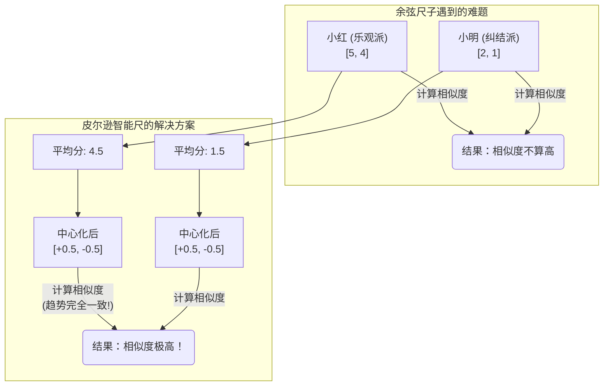

# 相似度计算：推荐的度量衡 (小白版)

你好呀！欢迎来到我们系列文档的最后一站！今天，我们要探讨一个非常朴素但又极其重要的话题：在推荐的世界里，我们怎么知道两个人"志趣相投"？

这就要靠我们的"度量衡"——相似度计算了。它就像一把尺子，能精确地量出两个用户或两个物品之间的"缘分指数"。

## 1. 万物皆可量：先变成向量

要想用数学尺子去量，我们得先把要量的东西变成"看得见、摸得着"的数学对象。在推荐系统里，这个对象就是向量 (Vector)。

想象一下，我们要衡量两个用户的品味，我们就把他们对所有电影的评分，变成一个长长的"评分向量"：

- 用户A (小红) 的评分向量 U_A = [5, 4, 0, 1, 0] (分别对应《战狼》、《流浪地球》、《小时代》、《前任3》、《喜羊羊》的评分，0代表没看过)
- 用户B (小明) 的评分向量 U_B = [4, 3, 0, 2, 0]

好了，现在"小红和小明有多像"这个问题，就变成了"向量A和向量B有多像"这个数学问题了。

## 2. 三把神奇的"尺子"：从不同角度量相似

世界上没有哪一把尺子能包治百病，不同的场景需要用不同的尺子。

### 尺子一：余弦相似度 —— "品味方向"测量尺

**它量什么**：两个向量在空间中的夹角。夹角越小，说明方向越一致，就越相似。

**好比是**：小红和小明都更喜欢科幻片（《战狼》《流浪地球》），而不是言情片（《小时代》《前任3》）。尽管小红打分普遍偏高，但他们喜欢的"大方向"是一致的。这把尺子就专门量这种"品味方向"，而不太关心打分的绝对高低。

### 尺子二：皮尔逊相关系数 —— "体谅你"的智能尺

**它量什么**：两个变量的线性相关程度。

**好比是**：这是余弦尺子的"情商升级版"。它在测量前，会先做一个非常贴心的动作：减去每个人的平均分。我们马上就会看到，这个小动作有多厉害。

### 尺子三：杰卡德相似度 —— "购物篮"重合度测量尺

**它量什么**：两个集合的交集大小，除以并集大小。

**好比是**：我们不关心你给苹果打了几分，只关心你的购物篮里有没有苹果。这把尺子就是看小红和小明的购物篮里，共同的商品占了所有不重复商品的多大比例。非常适合衡量"买没买"、"点没点"这种0/1行为的相似度。

## 3. 用更好的尺子，治推荐的"病"

推荐算法的进步，很大程度上就是"发明更好的尺子"来治病的过程。

### 病症一：打分标准不一样怎么办？(评分尺度偏置)

**病症描述**：
小红是个"乐观派"，电影不难看就给4-5分。小明是个"纠结派"，觉得还不错的电影也只给1-2分。就算他们俩喜欢的电影类型一模一样，用第一把"余弦尺子"去量，也会因为分数差异大，觉得他们"不是一路人"。

**治疗方案**：
立刻换上第二把"皮尔逊智能尺"！它在计算前，会先算出小红的平均分是4.5，小明的平均分是1.5。然后，它把每个人的原始打分都减去自己的平均分，得到一个"中心化"之后的分数。

看！经过"体谅"（中心化）之后，模型发现他们的品味趋势完全一样！病治好了。

### 病症二：人人都买的东西能说明啥？(热门物品偏置)

**病症描述**：
小红和小明都买过"可口可乐"。如果系统仅凭这个共同点，就认为他们是"同好"，那也太草率了。热门商品对区分用户的真实、独特品味的贡献应该更小。

**治疗方案**：
给我们的尺子加上"权重"功能！在计算相似度时，我们认为，越是小众的东西，权重越高。

**好比是**：
- "你俩都爱喝可乐？" -> 相似度 +1分
- "我的天！你俩居然都喜欢那个超级小众的、从没听过的乐队？" -> 相似度 +100分！

通过给小众物品更高的权重，我们就能更好地找到那些真正"灵魂共鸣"的用户。

到这里，我们本次深度探讨的所有内容就都总结完毕了。希望这六份"小白版"文档，能成为您在构建智能推荐系统道路上的一份清晰、易懂的导航图！
