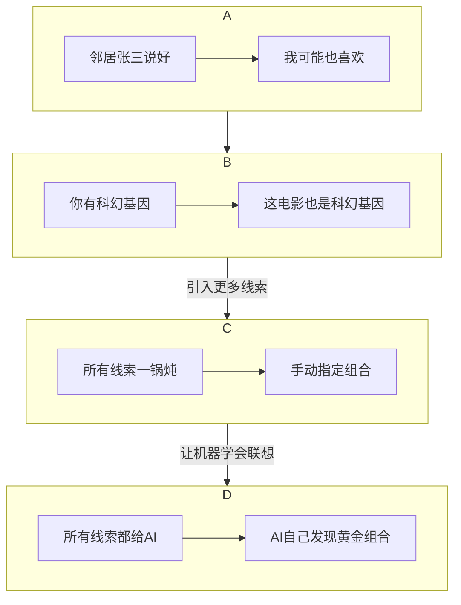

# 推荐模型的进化史 (小白版)

你好呀！今天我们来当一回"技术考古学家"，挖一挖推荐系统那些"老祖宗"级别的模型。你会发现，技术的发展就像打怪升级，每一代新模型都是为了解决上一代的"痛点"而诞生的。

这条进化之路的核心，就是模型如何学会更聪明地理解特征，特别是学会自动发现"特征组合"的秘密。

## 进化第一站：协同过滤 (CF) —— 邻里打听模式

这是推荐系统的"石器时代"，方法简单又淳朴，主要靠"群众的智慧"。

### UserCF (用户协同过滤):

**好比是**：你想看电影，不知道看啥。于是你去问邻居张三、李四、王五，发现他们都说《让子弹飞》好看，那你大概率也会喜欢。

**核心思想**："人以群分"，找到和你品味最像的"邻居"，看他们喜欢啥，就推荐啥给你。

### ItemCF (物品协同过滤):

**好比是**：你去超市买了"尿布"，收银员阿姨热情地问你："靓仔，要不要再带包啤酒？"

**核心思想**："物以类聚"，分析历史上"经常被一起购买"的商品，当你买了其中一样，就推荐另一样给你。在工业界，这种方法用得更广，因为"尿布和啤酒"的关系比"你和张三"的关系更稳定。

**痛点**：如果新搬来一个邻居（新用户），或者超市刚进了一批货（新商品），这个方法就傻眼了，完全不知道该怎么办（这就是冷启动问题）。而且，它只知道"谁买了啥"，对用户和物品的理解非常表面。

## 进化第二站：矩阵分解 (MF) —— 读心术模式

为了解决CF的"表面化"问题，大神们发明了"读心术"——矩阵分解。

**核心思想**：它不再只看表面行为，而是猜测行为背后的**"潜在因素"**。比如，你之所以喜欢《流浪地球》和《三体》，不是因为它们名字像，而是因为你骨子里有"科幻迷"、"硬核物理控"的潜在基因。这些"基因"就是隐向量 (Latent Factor)，也就是我们**Embedding**思想的早期雏形。

**工作方式**：模型会努力为每个用户和每个物品都"画"一个"基因图谱"（也就是隐向量）。预测你喜不喜欢一部电影，就看你们俩的"基因图谱"匹不匹配。

**巨大进步**：泛化能力大大增强！就算一部新电影没人看过，只要模型知道它的"基因图谱"（比如"科幻"、"灾难"），就能把它推荐给有对应"基因"的用户。

## 进化第三站：逻辑回归 (LR) —— 神探夏洛克模式

MF虽然厉害，但它还是只关心用户和物品的ID。而LR模型的出现，就像请来了一位能观察所有细节的"神探夏洛克"。

**核心思想**：把推荐变成一个破案过程，预测"在当前所有线索下，用户点击这个物品的概率有多大？"。这是一个里程碑，因为它允许我们把**所有能用的特征（U, I, C）**都当作"线索"扔给模型。

**工作方式**：这位"夏洛克"会把所有线索（用户年龄、物品价格、现在几点钟...）全部收集起来，然后给出一个"嫌疑人（物品）"的"犯罪概率（点击率）"。

**痛点**：这位"夏洛克"虽然能看很多线索，但脑子有点"直"，是个"线性思维"。他无法自己想明白"年轻女孩"和"口红"这两个线索凑在一起时，会产生1+1>2的化学反应。你必须手动告诉他："喂！注意一下，这两个特征要组合起来看！"（这就是人工特征交叉）。

## 进化第四站：因子分解机 (FM) —— AI夏洛克模式

人工组合特征太累了，于是，更聪明的"AI夏洛克"——因子分解机（FM）诞生了！

**核心思想**：让模型自己学会"联想"，自动发现哪些"线索"组合起来威力巨大。

**工作方式**：FM模型极其聪明，它为每一个特征（比如"年龄段=20岁"、"城市=北京"、"物品类别=口红"）都学习了一个Embedding向量（基因图谱）。当它需要判断"20岁"和"口红"的组合有多大威力时，只需要计算一下这两个特征的Embedding向量有多"匹配"（点积）就行了！

**巨大进步**：将算法工程师从繁琐、低效的人工特征交叉中解放出来，推荐系统的效果和效率都上了一个巨大的台阶！FFM则是FM的"精装修"版本，考虑得更细。

## 进化之路总结图

这条进化之路，本质上就是一部"推荐系统特征使用与理解能力"的升级史。
